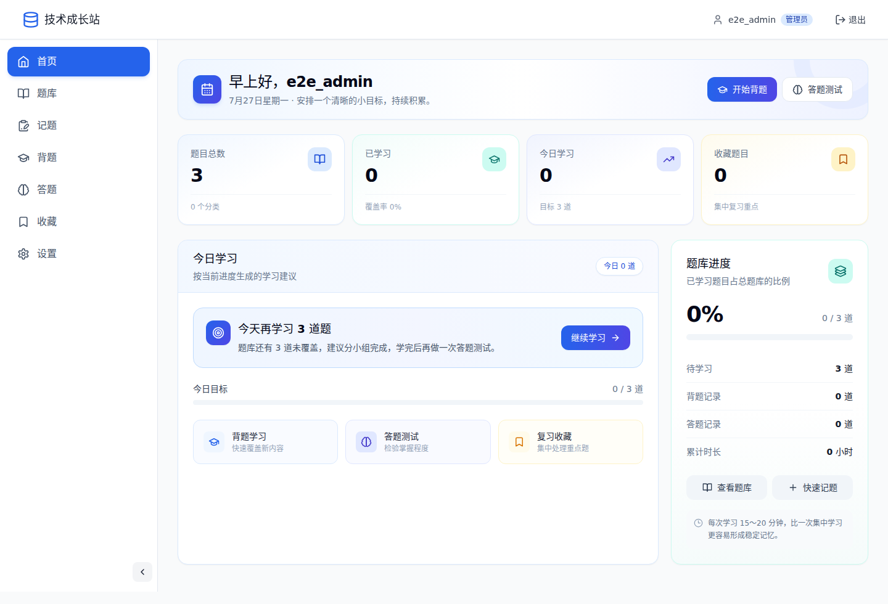
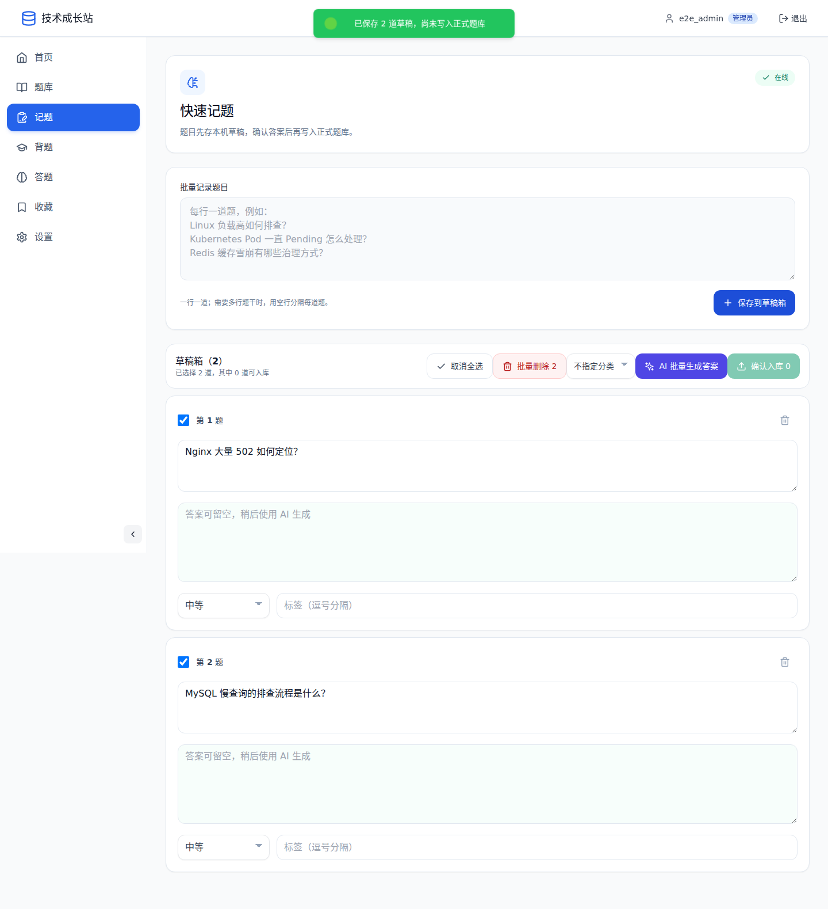
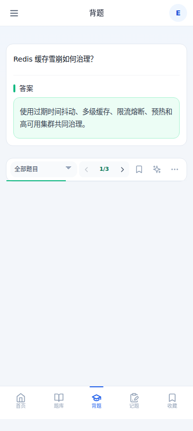

# 技术成长站

> Tech Growth Hub：面向 IT 学习与技术成长的开源题库、刷题和知识整理平台。

<p align="center">
  <a href="https://github.com/anhaot/tech-growth-hub/actions/workflows/ci.yml"></a>
  <a href="https://github.com/anhaot/tech-growth-hub/releases"></a>
  <a href="./LICENSE"></a>
</p>

技术成长站把零散遇到的技术问题，整理成一条可持续的成长路径：快速记题、AI 补全、人工确认入库、日常背题与答题、收藏回看和数据备份。适合运维、开发、测试、网络、安全等 IT 方向，也可以作为个人知识库或团队内部题库。



## 为什么做这个项目

很多题库只解决“存题”，技术成长站更关注从遇到问题到真正记住的完整流程：

```text
现场记题 → 草稿箱 → AI 生成答案 → 人工检查 → 正式题库 → 背题 / 答题 → 收藏回看
```

- 面试或工作现场只记录题干，允许一次录入多道题
- 草稿与正式题库隔离，未确认的 AI 内容不会污染题库
- 支持背题与答题两种学习模式、进度记录和收藏回看
- 支持 PWA 安装，快速记题草稿可保存在当前浏览器
- 支持 Markdown、分类、标签、收藏、搜索、导入导出和重复题治理
- AI Key 只保存在服务端，支持多种 OpenAI 兼容模型服务

## 产品截图

<table>
  <tr>
    <td width="68%"></td>
    <td width="32%"></td>
  </tr>
  <tr>
    <td align="center">多题记录、AI 补答案、确认后入库</td>
    <td align="center">手机端随时背题与复习</td>
  </tr>
</table>

## 核心能力

| 模块 | 能力 |
| --- | --- |
| 面试记录 | 一行一道或空行分隔多行题干，本机离线草稿，批量 AI 生成答案，检查后选择性入库 |
| 题库管理 | 题目答案可选、保存前 AI 补全、Markdown、分类、难度、标签、搜索、批量操作和重复题合并 |
| 学习模式 | 背题、答题、随机切题、学习进度和收藏回看 |
| 离线体验 | PWA 应用壳与浏览器本地记题草稿 |
| AI 辅助 | 批量生题、原始题干生成答案、答案草稿、题目润色、标签建议和 AI 助手 |
| 用户权限 | 独立题库、集成题库、分类范围授权和细粒度权限 |
| 数据运维 | MariaDB / MySQL 默认持久化、SQLite 可选、完整备份恢复与数据库迁移 |

## 快速开始

### Docker Compose

```bash
git clone https://github.com/anhaot/tech-growth-hub.git
cd tech-growth-hub
cp .env.example .env
```

先分别生成并填写 `.env` 中的 `JWT_SECRET`、`AI_CONFIG_ENCRYPTION_KEY`、`MYSQL_PASSWORD` 与 `MYSQL_ROOT_PASSWORD`（四个值不要复用）：

```bash
openssl rand -hex 32
```

然后启动：

```bash
docker compose up -d --build
```

访问 `http://127.0.0.1:10089`。默认管理员账号和密码均为 `admin`；首次登录会被强制要求设置符合规则的新密码，完成后才能进入系统。生产环境请同时配置 HTTPS、明确的 `ALLOWED_ORIGINS` 和定期备份。

### 使用发行版

[GitHub Releases](https://github.com/anhaot/tech-growth-hub/releases) 提供：

- GitHub 自动生成的源码 `zip` / `tar.gz`
- 已构建的 `tech-growth-hub-<version>-prebuilt.tar.gz`
- `ghcr.io/anhaot/tech-growth-hub-api` 与 `ghcr.io/anhaot/tech-growth-hub-web` 多架构镜像

下载发行包后可使用 `compose.release.yaml` 启动，无需在本机编译源码。

## 本地开发

要求 Node.js 22+、npm 10+。

```bash
# API
cd api
npm ci
npm run dev

# Web（另一个终端）
cd web
npm ci
npm run dev
```

默认端口为 Web `3000`、API `3001`。开发、调试和数据库说明见 [开发指南](./docs/development.md)。

## 项目结构

```text
tech-growth-hub/
├── api/                     # Express API、数据库和 AI 服务
│   ├── src/
│   │   ├── config/
│   │   ├── database/
│   │   ├── middleware/
│   │   ├── routes/
│   │   ├── services/
│   │   └── utils/
│   └── tests/               # API 安全与回归测试
├── web/                     # React PWA
│   ├── public/              # Manifest、图标和 Service Worker
│   ├── src/
│   │   ├── api/
│   │   ├── components/
│   │   ├── lib/
│   │   └── pages/
│   └── e2e/                 # 桌面、手机和离线浏览器测试
├── docs/                    # 使用、部署、开发和运维文档
├── compose.yaml             # 源码构建部署
└── compose.release.yaml     # GHCR 发行镜像部署
```

## 技术栈

| 层 | 技术 |
| --- | --- |
| Web | React 18、TypeScript、Vite 8、React Router、Zustand、Tailwind CSS、IndexedDB、Service Worker |
| API | Node.js 22、Express、TypeScript、Zod、Helmet、JWT、rate-limiter-flexible |
| 数据 | SQLite / MySQL、追加式复习事件、完整备份恢复 |
| 测试 | Node Test Runner、Supertest、ESLint、TypeScript、Playwright |
| 发行 | Docker、Docker Compose、GitHub Actions、GitHub Releases、GHCR |

## 安全设计

- 登录态使用 `HttpOnly` Cookie；前端不持久化 Bearer token
- 写操作使用双重提交 CSRF 令牌，Cookie 同时启用 `SameSite`
- AI Key 使用 AES-256-GCM 加密后存入数据库和备份，不进入浏览器、离线题包或 Service Worker Cache
- Service Worker 只缓存静态应用资源；题包由用户主动下载并按用户隔离
- API 提供权限校验、速率限制、请求体大小限制、CORS 白名单和安全响应头
- 生产模式拒绝弱 `JWT_SECRET`，容器使用非 root 用户并提供就绪探针
- CI 使用锁文件安装、依赖审计、API 回归和真实浏览器测试

安全问题请按 [SECURITY.md](./SECURITY.md) 中的私下报告方式提交。

## 验证命令

```bash
cd api
npm run lint
npm run typecheck
npm test
npm audit --omit=dev

cd ../web
npm run lint
npm run build
npm run e2e
npm audit --omit=dev

cd ..
JWT_SECRET=replace-with-at-least-32-characters \
AI_CONFIG_ENCRYPTION_KEY=0000000000000000000000000000000000000000000000000000000000000000 \
docker compose config --quiet
```

## 后续方向

- Anki / Markdown 学习记录导出
- 语音快速记题与图片 OCR
- 错题本、知识点掌握热力图和周报
- 相似题聚类与更精细的复习调度参数
- 可选的端到端加密离线题包

## 文档

| 文档 | 内容 |
| --- | --- |
| [用户手册](./docs/user-guide.md) | 题库、学习、记题和设置操作 |
| [AI 指南](./docs/ai.md) | AI 配置、答案模式和安全边界 |
| [部署说明](./docs/deployment.md) | Docker、Compose 与生产配置 |
| [运维手册](./docs/operations.md) | 健康检查、备份、恢复和排障 |
| [开发指南](./docs/development.md) | 开发环境、目录约定和测试 |
| [权限说明](./docs/permissions.md) | 用户类型、分类范围和权限模型 |
| [安全审查](./docs/security-audit.md) | 已修复项、剩余风险和复核方式 |
| [贡献指南](./CONTRIBUTING.md) | Issue、分支、测试和 PR 约定 |
| [更新日志](./CHANGELOG.md) | 版本变更记录 |

## License

本项目基于 [LICENSE](./LICENSE) 中的条款发布。
