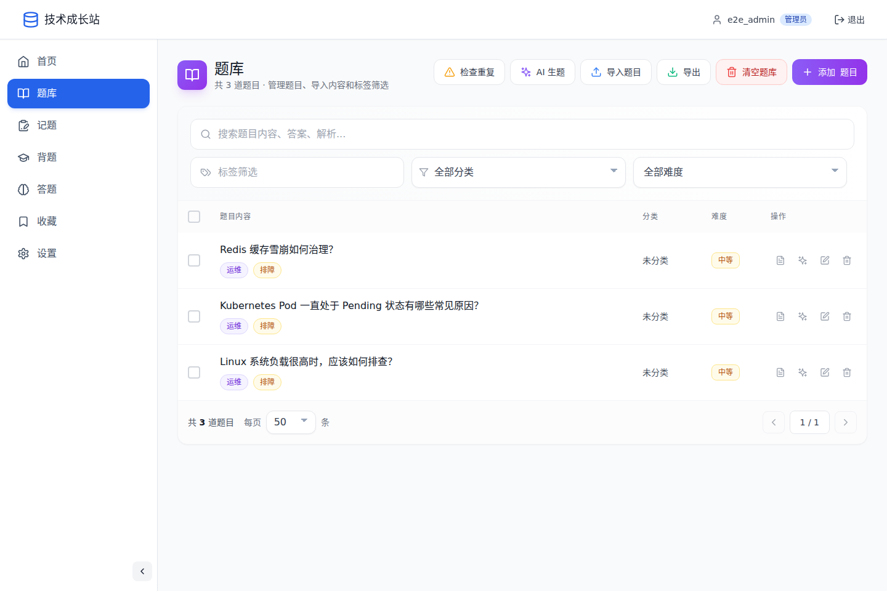
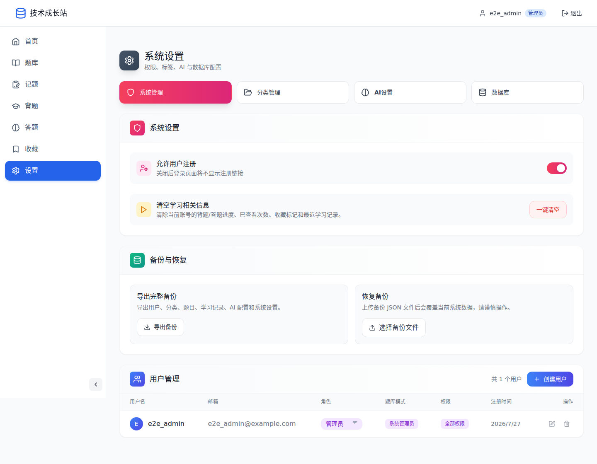

# 技术成长站

> 面向个人与团队的开源 AI 题库、知识治理和学习复习平台。

<p align="center">
  <a href="https://github.com/anhaot/tech-growth-hub/actions/workflows/ci.yml"></a>
  <a href="./LICENSE"></a>
</p>

技术成长站用于持续建设结构化技术题库，并把题目维护、AI 内容协作、分类标签治理、学习复习、用户权限和数据运维集中在一个系统中。它适用于运维、开发、测试、网络、安全等技术方向，也可以用于团队培训、面试题管理和个人知识库。


## 产品能力

```text
内容录入 / 导入 / AI 生题
          ↓
题目编辑与人工确认
          ↓
分类、标签、查重与批量治理
          ↓
背题、答题、收藏与学习进度
          ↓
备份、恢复、权限与数据库运维
```

| 模块 | 主要能力 |
| --- | --- |
| 题库管理 | 新增、编辑、搜索、筛选、分页、Markdown、分类、难度、标签和批量操作 |
| 内容治理 | 标签规范化、标签重命名、相似题检查、重复题合并和题库导入导出 |
| AI 协作 | 批量生题、答案草稿、题目润色、标签建议、知识分析和上下文对话 |
| 多模型管理 | 多个 OpenAI 兼容模型、独立 API 凭据、默认模型切换、逐项可用性检查 |
| 学习复习 | 背题、答题、随机切题、学习进度、复习记录和收藏 |
| 用户权限 | 管理员、独立题库、集成题库、分类范围授权和细粒度功能权限 |
| 数据管理 | MariaDB / MySQL、SQLite、完整备份恢复、数据库迁移和一致性校验 |
| 多端体验 | 响应式桌面与手机布局、PWA 应用壳、浏览器本地草稿 |

所有 AI 生成内容都应由使用者确认后再写入正式题库。系统不会把 AI 输出视为无需审核的事实来源。

## 产品截图

<table>
  <tr>
    <td width="50%"></td>
    <td width="50%"></td>
  </tr>
  <tr>
    <td align="center">题库搜索、筛选与内容维护</td>
    <td align="center">用户、权限、AI、备份和数据库管理</td>
  </tr>
  <tr>
    <td width="50%"></td>
    <td width="50%"></td>
  </tr>
  <tr>
    <td align="center">手机端背题、答题与复习</td>
    <td align="center">批量记录和人工确认后入库</td>
  </tr>
</table>

## 快速部署

要求：Docker Engine 与 Docker Compose。

```bash
git clone https://github.com/anhaot/tech-growth-hub.git
cd tech-growth-hub
cp .env.example .env
```

分别生成 `JWT_SECRET`、`AI_CONFIG_ENCRYPTION_KEY`、`MYSQL_PASSWORD` 和 `MYSQL_ROOT_PASSWORD`，四个值不要复用：

```bash
openssl rand -hex 32
```

填写 `.env` 后启动：

```bash
docker compose up -d --build
```

应用镜像使用 `.env` 中的 `APP_VERSION`，格式为 `vYYMMDD-N`，例如 `v260805-1`。项目不会默认构建或发布 `latest` 标签。

访问 `http://127.0.0.1:10089`。默认管理员用户名和密码均为 `admin`，首次登录必须修改密码。生产环境还应启用 HTTPS、设置明确的 `ALLOWED_ORIGINS` 并建立定期备份。

## AI 模型配置

进入 `设置 → AI设置`：

1. 在“API 凭据”中保存凭据名称、Base URL 和 API Key。
2. 在“API 配置”中新增模型，选择已有凭据并从模型列表中选择模型。
3. 选择默认模型。题库生题、答案草稿和学习页 AI 助手也可以临时选择其他已配置模型。
4. 点击“检查模型可用性”。每个模型收到响应后会立即更新，全部结束后显示可用、不可用、超时或无法确认的汇总。

模型出现在 `/models` 列表中，不一定代表当前账户拥有推理权限；可用性检查会发起一次最小推理请求进行确认。

API Key 只在凭据管理界面录入，服务端使用 AES-256-GCM 加密保存，不会通过配置查询接口返回到浏览器。

## 本地开发

要求 Node.js 22+、npm 10+。

```bash
# API
cd api
cp .env.example .env
# 没有本地 MySQL 时可设置 DATABASE_TYPE=sqlite
npm ci
npm run dev

# Web（另一个终端）
cd web
npm ci
npm run dev
```

默认开发端口为 Web `3000`、API `3001`。

## 项目结构

```text
tech-growth-hub/
├── api/                     # Express API、权限、数据库与 AI 服务
│   ├── src/
│   │   ├── config/
│   │   ├── database/
│   │   ├── middleware/
│   │   ├── routes/
│   │   ├── services/
│   │   └── utils/
│   └── tests/               # API 安全与回归测试
├── web/                     # React 响应式 PWA
│   ├── public/
│   ├── src/
│   └── e2e/                 # Playwright 浏览器测试
├── docs/                    # 使用、AI、部署、运维与开发文档
├── compose.yaml             # 源码构建部署
└── compose.release.yaml     # 发布镜像部署
```

## 技术栈

| 层 | 技术 |
| --- | --- |
| Web | React 18、TypeScript、Vite、React Router、Zustand、Tailwind CSS、IndexedDB、Service Worker |
| API | Node.js 22、Express、TypeScript、Zod、Helmet、JWT、rate-limiter-flexible |
| 数据 | MariaDB / MySQL、SQLite |
| 测试 | Node Test Runner、Supertest、ESLint、TypeScript、Playwright |
| 部署 | Docker、Docker Compose、Nginx |

## 安全设计

- 登录态使用 `HttpOnly` Cookie，写操作校验 CSRF 令牌。
- 密码使用单向哈希存储，首次默认管理员登录必须改密。
- AI Key 加密后写入数据库和备份，不进入前端持久化数据。
- AI 自定义地址执行协议、主机和运行时解析校验，降低 SSRF 风险。
- 题库、AI 配置、学习数据均校验用户归属和细粒度权限。
- Service Worker 不缓存 `/api/` 响应，只缓存静态应用资源。
- API 包含速率限制、请求体限制、CORS 白名单和安全响应头。

安全问题请按 [SECURITY.md](./SECURITY.md) 私下报告。

## 验证

```bash
cd api
npm run typecheck
npm run lint
npm test
npm audit --omit=dev

cd ../web
npm run build
npm run lint
npm run e2e
npm audit --omit=dev

cd ..
docker compose config --quiet
```

## 文档

| 文档 | 内容 |
| --- | --- |
| [用户手册](./docs/user-guide.md) | 页面、题库、学习、AI 与管理操作 |
| [AI 指南](./docs/ai.md) | 凭据、模型、生成能力、检查机制与排障 |
| [部署说明](./docs/deployment.md) | Docker、环境变量、数据库与生产部署 |
| [Release 下载](./docs/release-assets.md) | 预构建包、独立镜像、校验和离线导入 |
| [运维手册](./docs/operations.md) | 健康检查、日志、备份、恢复和故障定位 |
| [开发指南](./docs/development.md) | 项目结构、开发环境、测试和编码约定 |
| [权限说明](./docs/permissions.md) | 用户类型、分类范围和权限模型 |
| [安全审查](./docs/security-audit.md) | 安全边界、验证结果和剩余风险 |
| [贡献指南](./CONTRIBUTING.md) | Issue、分支、测试和 PR 约定 |
| [更新日志](./CHANGELOG.md) | 版本变更记录 |

## License

本项目基于 [LICENSE](./LICENSE) 中的条款发布。
